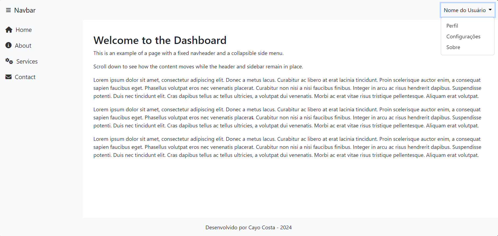
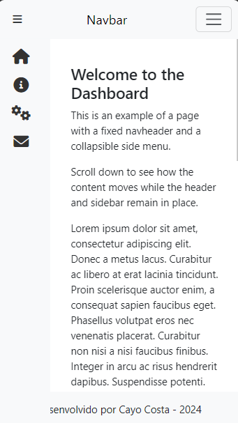

# Exemplo com Navheader Fixo e Side Menu

Este projeto demonstra uma página web com um `navheader` fixo no topo e um menu lateral (`sidebar`) que pode ser colapsado. A página utiliza o Bootstrap para a estrutura e o Font Awesome para os ícones.

 

 

## Descrição

Este projeto é um exemplo básico de layout com um cabeçalho fixo e um menu lateral que pode ser colapsado. É ideal para dashboards e aplicativos administrativos onde um menu de navegação lateral é necessário. O menu lateral e o cabeçalho são responsivos e adaptáveis para diferentes tamanhos de tela.

## Funcionalidades

- **Cabeçalho Fixo**: O cabeçalho (`navheader`) permanece fixo no topo da página.
- **Menu Lateral Colapsável**: O menu lateral (`sidebar`) pode ser expandido e colapsado para maior flexibilidade.
- **Efeito de Hover e Ativo**: Itens do menu lateral têm um efeito de destaque ao passar o mouse e quando estão ativos.
- **Responsivo**: Layout adaptado para diferentes tamanhos de tela.

## Tecnologias Utilizadas

- **HTML**: Estrutura da página.
- **CSS**: Estilização e layout.
- **Bootstrap**: Framework CSS para design responsivo.
- **Font Awesome**: Biblioteca de ícones.

## Como Usar

1. **Clone o Repositório**

   ```bash
   git clone https://github.com/CayoSCosta/Template_Padrao.git
